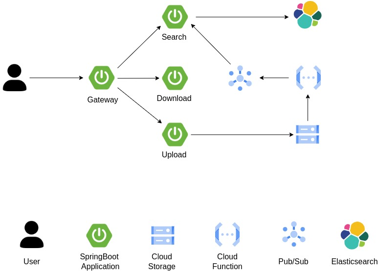
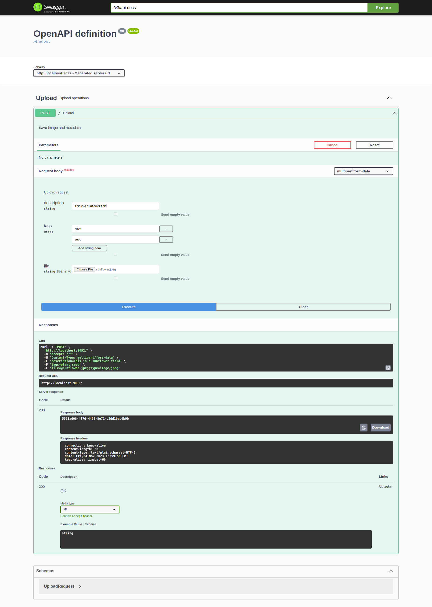
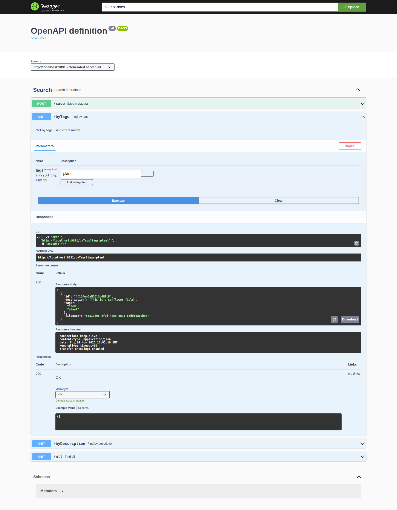
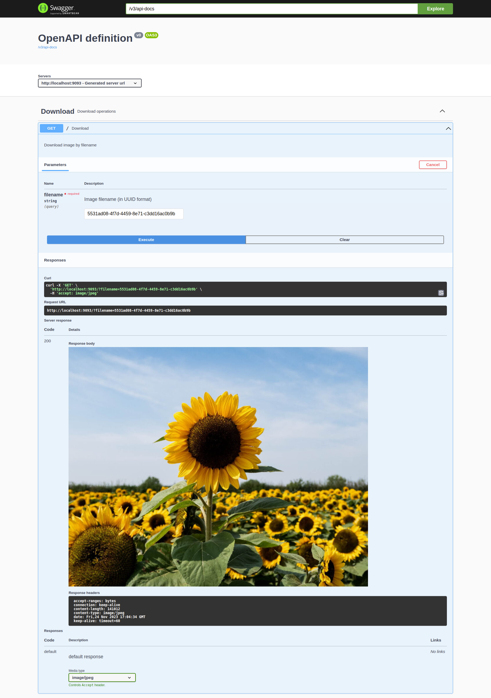
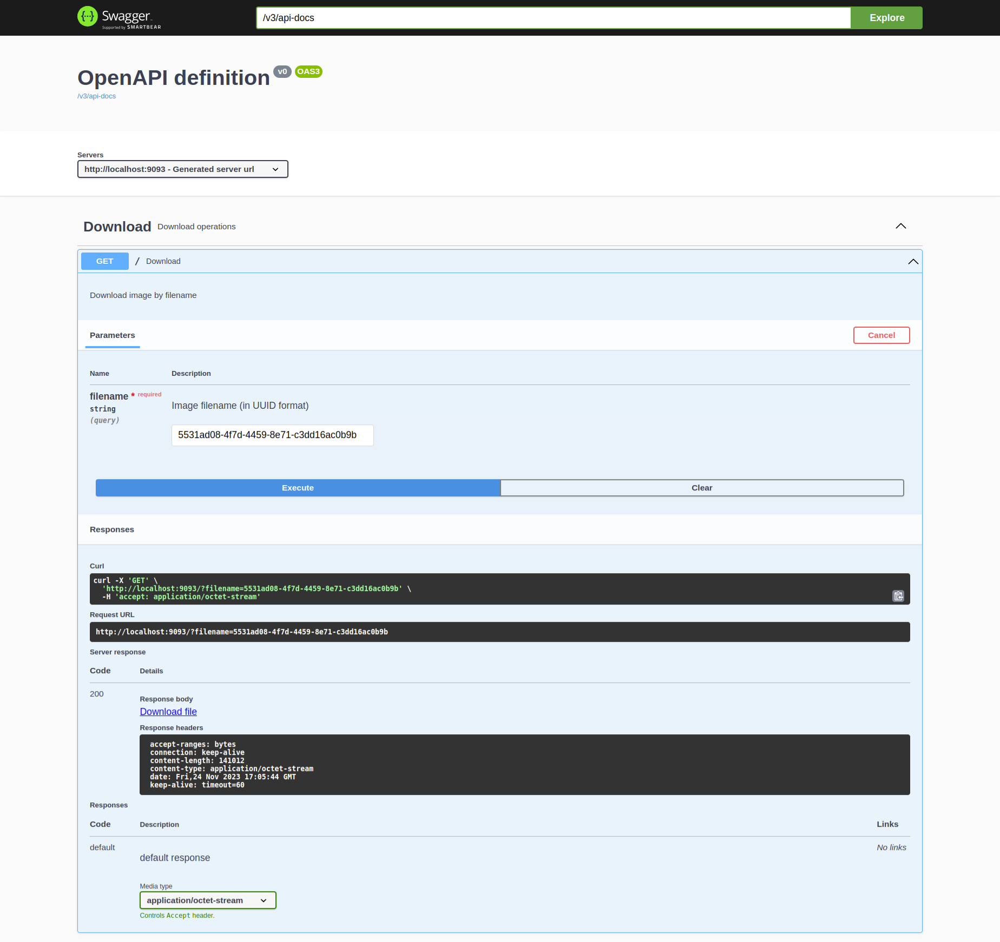
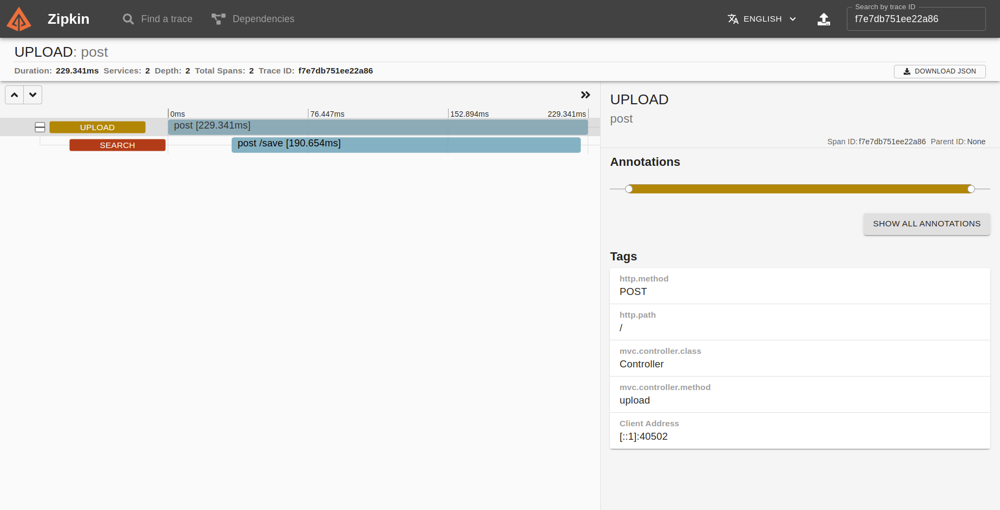

### Description
A demo project, built to demonstrate usage of the microservice patterns.
Application provides functionality of an image storage, with metadata linked to images. 
User can perform search by metadata, preview, and download individual images.

User can interact with application by utilizing Swagger UI, which available at
http://localhost:9090/{service}/swagger-ui/index.html, where `{service}` is one of the service names (`upload`, `search`, `download`) 

Project built with Spring Boot, Spring Cloud, and Google Cloud Platform services.

Patterns used
- Distributed configuration
- Distributed tracing
- Service discovery
- API Gateway
- CircuitBreaker
- CQRS

### Architecture

### Screenshots
#### Upload API

#### Search API

#### Download API
Response section with preview 

Response section with download link

#### Request tracing
Zipkin server at http://localhost:9411

### How to run
Application can be run with, or without cloud services.

With cloud services:
- Create a service account and save access token in file `gcpServiceAccount.json` in project root dir
- Create Cloud Storage bucket, and change bucket name in `consulCloudConfig.sh` to your bucket name
- Create Pub/Sub topic, change properties in `search/src/main/resources/application.properties` to your project name, and your topic name respectively
- Create notifications for Cloud Storage https://cloud.google.com/storage/docs/pubsub-notifications
- Start services from `docker-compose.yaml`
- Run script `consulCloudConfig.sh` to set shared properties
- Run Spring Boot applications `gateway`, `download`, `search`, `upload`

Without cloud services
- Start services from `docker-compose.yaml`
- Run script `consulCloudConfig.sh` to set shared properties
- Activate `local` profile for services `upload` and `download`
- Run Spring Boot applications `gateway`, `download`, `search`, `upload`

